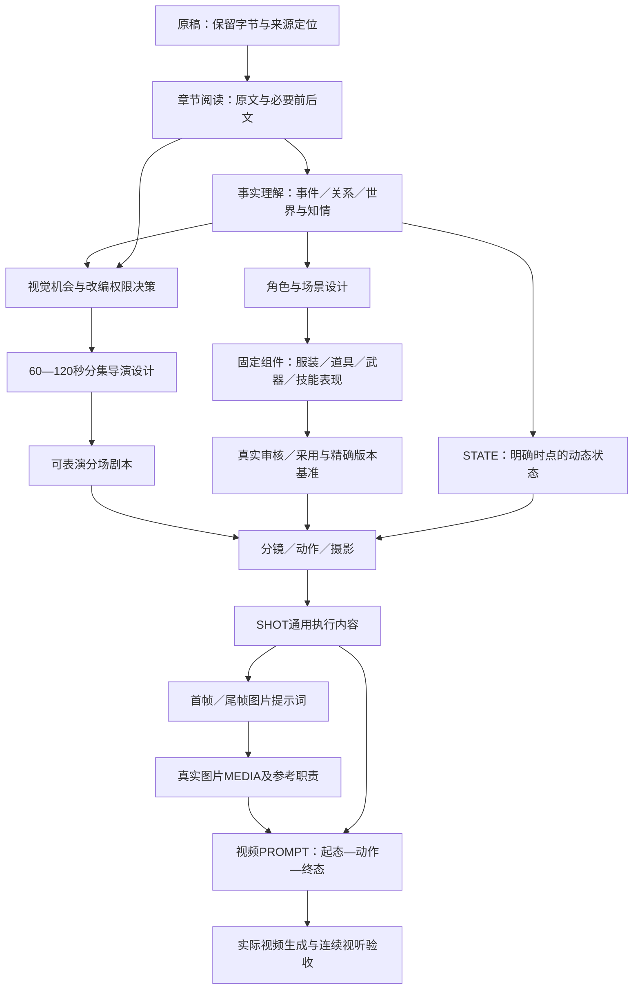

# 小说→AI漫剧：全链路审查与共享系统重构

日期：2026-10-02，Asia/Shanghai。授权范围：共享系统实施；项目只读取证，不替换故事或视觉采用基准。实施检查记录见[回归与验收](2026-10-02_工业化重构回归与验收.md)。

## 为什么有大量规则仍会产生机械结果

这轮证据支持的主要问题是**创作需要的内容与执行时得到的内容、固定资产与镜头中重新描述的内容之间没有足够明确的连接**。规则已经允许二次创作，但下游若只收到摘要且不回查原文，遗漏的前史不能靠更高推理可靠恢复；已声明固定设计又可以被逐镜描述替换时，精确版本引用也无法独自防止重设计。填写结构越完整，不一定越能暴露这两类断点。

不是所有观察都已被证实。《最强狂暴系统》首集已有金人授艺、拳掌接触、三树冲击、微反应和声音设计，不能称其完全没有导演意识。首集8—14秒写有“零碎记忆不用另开世界观闪回”，说明现代前史未呈现也包含主动压缩选择，不能全归因于事件遗漏。缺少视觉机会取舍记录，尚不能判断该选择是否充分；14—42秒拍蚁、系统与授艺的持续压力，以及101—113秒步行的叙事增量，仍需正常读演判断。也没有足够多视角／视频证据证明面部漂移或生成成功率。本次不调整模型推理档位，不编造“高推理导致模板化”的实验结论。

### 当前基准与实际范围

只读 `status --project projects/IP003_最强狂暴系统 --json` 返回成功。登记486项：CH156、CHAR1、EP100、SC213、LOC3、WORLD2、PROP1、PLOT2、STATE2、REPORT5、MEDIA1；没有SHOT、PROMPT。项目当前登记的下列版本用作证据：

| 证据 | 精确版本／位置 | 本轮含义 |
| --- | --- | --- |
| 第一章正文与事件 | [CH001正文](../../../projects/IP003_最强狂暴系统/.ip-system/snapshots/IP003-CH-001/1.0.0/正文.md)、同目录asset.json | 全文读取；网吧电击前史存在，但E001—E004没有记录此段 |
| 首集 | [EP001元数据](../../../projects/IP003_最强狂暴系统/.ip-system/snapshots/IP003-EP-001/1.1.0/asset.json)的data.script | 登记采用1.1.0；从活埋开场，预估126秒，未实测；不在本次修改 |
| 文学角色 | CHAR001@1.0.0 | 多人物汇总与阶段描述；不能自动作为单张角色定妆固定组合 |
| 文字视觉报告 | REPORT002采用1.0.1，工作1.0.4 | 不能按“最新工作版本”代替采用依据 |
| 正面图片候选 | MEDIA004@1.0.1 | 已实际看冻结正面，未正式采用；实际提示词与护腕结构支持新方向的修订需求，不证明跨角度或视频漂移 |
| 长篇阅读记录 | REPORT001@1.4.1的范围说明、目录与元数据 | 上游标注真武大陆2798章范围；本轮没有重新阅读这2798章或全书 |

共享规则、九入口、00—24阶段手册实际审读，由分工记录汇总；入口配置只提供UI名称和调用策略。代码、测试、上下文、编译、冻结／审核／采用接口已检查。未发现后台模型调度、常驻子代理服务或独立创作数据库；当前会话AI承担创作，文件、project.json及.ip-system承担存储。缓存和旧交接不是事实源。既有非本轮脏改保留，根releases不重建。

## 原文到最终视频提示词的数据流

下面“原文”指实际读入正文，不指持有原稿或哈希校验；“摘要”仅作定位。“负责Agent”全部是当前会话AI，没有自动委派事实。审核、采用和生成依本次授权裁剪，图中尾端不是本轮已经生产的媒体。

| 节点：输入→输出 | 负责Skill／手册及调用 | 上下文／原文与摘要 | 创作与修改权限 | 资产产生／固定资产消费 | 主要断点 |
| --- | --- | --- | --- | --- | --- |
| 接入：原稿→可定位原稿／选章阅读 | comic-studio／01，实际接入时 | 原始字节和显式编码；不摘要改写 | 不清洗原稿；阅读变换可追溯 | 来源文件，进入生产才建CH；不读视觉资产 | 编码、广告清理可能丢失内容 |
| 理解：正文→事件、人物关系、剧情价值 | comic-studio／01、02 | 本批正文与相邻因果，摘要用于归并 | 分析推断标性质，不先套拆集 | CH／WORLD／CHAR／PLOT／STATE | 仅提“大事件”遗漏低篇幅视觉信息 |
| 机会：原文片段→视觉机会候选 | comic-studio／06 | 回查相关原文；必读范围明确 | F—M表达扩写，A/B保护或保留 | 决策附既有EP／PLOT／REPORT；读故事基准 | 摘要替代正文，自动删除前史 |
| 分集：事件组合→集目标与戏剧单元 | comic-studio／06、17 | 原文、事实与视觉机会、当前目标 | C—E/N有理由的压合重排删；不改核心结果 | EP，消费角色／世界／状态 | 一章一集或按字数拆分 |
| 剧本：导演单元→实际动作和对白 | comic-studio／06、16 | 本集必要正文与已选表达 | 授权改写、反应、环境与伏笔 | SC；精确人物／地点版本 | 五段标签替代场面，解释对白挤占画面 |
| 人物：身份与阶段→面部、体型、行为 | comic-image-assets／03 | 原文外貌、行为及当前采用设计 | 普通外观补全；身份因果不自造 | CHAR；选确认MEDIA，缺图不伪称锁脸 | 身份档案与固定图像组合混在一起 |
| 服装：动作／身份→轻战或日常结构 | comic-image-assets／03 | 家庭经济与阶段、动作需求 | 设计剪裁配色；不要自动加职业装备 | PROP服装组件；CHAR引用 | 每镜重设计、装饰复杂度无人判断 |
| 道具／武器：事件需求→独立物件 | comic-image-assets／03、05 | 获得、携带、使用时点原文 | 普通形状补全；不提前获得能力或物件 | PROP与MEDIA；精确版本消费 | 定妆图百科化，技能自动映射持械 |
| 场景：事件空间→可复用场景 | comic-image-assets／05 | 场景正文、世界与场次功能 | 空间、材质、光线合理补全 | LOC／MEDIA；读已有空间与道具 | 环境只有背景，状态毁损不继承 |
| 技能／特效：机制→动作与效果语言 | jimeng-video-prompts／18 | WORLD机制、获得时点、原文交锋 | 强化可见作用；不改胜负原因及功能 | WORLD＋PROP／MEDIA（实际需要时）；STATE | 视觉奇观被当新能力，或过度保守删展示 |
| 定妆：设计与职责明确参考→实际图片 | comic-image-assets／03、19模板 | 选定CHAR／组件与确认参考 | 生成／编辑需对应授权，后续不重设固定项 | MEDIA；明确ID、版本、文件和职责 | 图片好看被当设计已锁定／已采用 |
| 连续性：基准＋事件→起止状态 | comic-media-review／04 | 精确STATE边界，未知仍未知 | 只记录有依据变化，不能补剧情圆错误 | STATE；读身份和组件 | 章末、后期装备污染当前时点 |
| 分镜：剧本→镜头叙事与可见行动 | jimeng-video-prompts／07 | 实际SC、导演意图、适用基准 | 镜头表现与反应；不另改剧情结果 | SHOT；固定组件与动态状态 | 摘要当剧本；固定外观重新展开 |
| 动作／摄影：交锋→起态过程终态／机位 | jimeng-video-prompts／18、08、19 | 本镜动作链、地标和持械手 | 动作强化与运镜按功能设计 | SHOT；精确角色、场景与道具 | 复杂动作、特效和运镜同时过载 |
| 图片稿：瞬间→首尾帧正文 | comic-image-assets／09、10 | SHOT明确瞬间、固定组件和状态 | 编译不创作；AI先补缺项 | PROMPT或独立MEDIA附件；读固定描述 | 起止时点混入过程，参考职责漏传 |
| 视频稿：镜头＋真实参考→视频PROMPT | jimeng-video-prompts／09、10 | 起态—过程—终态、真实参考职责 | AI导演表达，编译器执行已选内容 | PROMPT；SHA/版本及MEDIA文件 | 锁定基准被description覆盖、控制文字变漂亮口号 |
| 一致性：稿件／实际媒体→缺陷和返修 | comic-media-review／11、16、04 | 内容回查＋实际看图／播放／听音 | 指定范围修订，不反改事实圆生成错 | 审核记录／REPORT；精确成果版本 | 结构通过冒充好看，抽帧冒充整段验收 |
| 成片：真实素材→音轨、剪辑、交付 | audio／capcut／rights，20—24按需 | 真实媒体和取用证据 | 用户授权对应操作 | MEDIA／REPORT／交付包 | 未执行生成或播放仍报工业化完成 |

## 证实的缺口与本次修复

| 缺口及证据 | 对创作的影响 | 已实施的机制 |
| --- | --- | --- |
| CH001正文有电击前史，事件E001—E004均未记录 | 事件级上下文没有机会发现这段；不是原文没有写 | 06加入视觉机会扫描与A—N权限；上下文声明必读原文并核对实际覆盖 |
| 旧上下文complete仅表示所选内容装入 | 事件摘要装满也可能缺少本任务必要原文 | creative_brief.required_readings绑定精确全文哈希和范围，缺失返回失败 |
| 旧SHOT.asset_visuals.description优先于visual_base | 同一版本仍可能被镜头重新描述，版本身份和内容控制脱节 | locked及固定组件执行继承，description冲突拒绝；动态另列 |
| 03固定组合含服装装备，汇总CHAR/PROP含跨阶段条目 | 存在下游重复打包角色百科、提前显现阶段装备的风险；本轮样本未证实提前背刀 | 身份、衣装、物件、技能与动态状态分责；组件引用既有类型 |
| MEDIA004真实词要求皮腕紧密缠袖口，实际正面有交叉带和堆褶 | 复杂造型与轻束腕目标冲突，动作视频存在维护风险 | 视觉元素预算、动作反推服装、张天昊案例规范；未修改该候选图 |
| 06内嵌交付模板，00默认1—3分钟且固定顺序倾向先全套资产 | 不适用短剧目标的默认和重复填表可能挤压决策 | 默认60—120秒；06唯一模板移至25；入口按当前缺口裁剪 |
| stage.skill与agents/openai.yaml只是入口说明 | 容易把“有技能”误认为“已执行了专业代理” | 保留当前AI职责和实际阅读范围，未建设同义调度平台 |

保留已有登记、快照、审核、事务和依赖底座。替换核心虽然获授权，但本轮没有证据支持重建数据库或代理调度；修复具体接口断点即可降低重复架构和迁移风险。固定资产锁只约束声明的执行基准，不保证模型遵循或镜头动态文字没有语义越界。

集成复核还发现固定LOC环境组件虽已记录为编译输入，但最初只展开主场景描述；现已将补充环境的名称、职责和具体形态送入首帧、尾帧和视频，并用CHAR引用LOC、主LOC引用子LOC两种测试验证。这说明“版本已引用”与“实际要求已传给生成正文”仍需分别核对。

真实项目严格结构检查返回成功：486资产、549版本、485采用，零错误；保留3181条现有上游变版依赖复核提示，样例为REPORT001@1.4.0与当前采用1.4.1的差异。提示未被清除，不把结构通过写成项目内容／媒体通过。status读取仍有逐资产和复核阶段重复哈希的I/O成本，未在本轮替换其存储与性能实现。

## 用户49项观察的核查结论

| 编号／观察范围 | 结论与依据 | 处理 |
| --- | --- | --- |
| 1—5 机械、生硬、搬运、导演与二次创作不足 | 风险成立，不能概括已读首集全部如此；首集有授艺与动作因果 | 先剧作决策，再模板登记；内容分维度审查 |
| 6—8 视觉机会、短句删除、文字表面忠实 | CH001前史事件遗漏已证实；首集未呈现但不能仅此认定取舍错误 | 每项视觉机会留剧情功能与时长取舍 |
| 9—15 影视语言、伏笔、环境、动作、微反应、转场、画面爽点 | 首集已有动作与反应，前史转场有未用机会；没有证明七项全部缺失 | 导演功能与可见兑现逐项判断，避免概念评分 |
| 16—20 模板脸、辨识度、因果与堆装饰 | 当前候选可观察装饰聚集；“标准AI帅哥”属审美判断，无对照实验 | 角色因果链、识别层级、商业吸引力并审 |
| 21—22 自动加甲／配件、过设计 | 皮腕与亮玉结构有实图证据；未证明所有列举装饰都存在或自动产生 | 设计前选识别重点，返修同时检查保留项 |
| 23—24 多角不一致、批次漂移 | 证据不足：唯一登记图为正面候选 | Face Geometry Lock方法已补；真实多角／视频验证待授权 |
| 25—28 固定资产、重设计、预设武器、饰物独立资产 | 有版本注册底座；固定内容继承与组件职责缺口已证实，未发现本轮样本提前背刀 | 固定组件精确引用，不把技能默认映射武器 |
| 29—31 百科图、塞太多、解耦不足 | 汇总CHAR/PROP与核心组合存在承载风险，不能称唯一图包含整部百科 | 单图承担明确职责，衣物与饰物分资产 |
| 32—34 版本、锁定、引用缺失 | 版本与精确引用早已存在；可执行固定内容保护此前不足 | 保留底座，新增锁定执行语义及组件引用 |
| 35—36 复杂结构与纹样 | MEDIA004正面皮腕、缠带、袖褶及衣纹已查看 | 轻束腕与纹样复杂度预算 |
| 37—40 视频崩坏、手部／位置／纹样变化 | 视频风险，尚无本项目视频可验证 | 明确可见检查与动态验证边界，不编成功率 |
| 41—43 技能数量、重叠、冲突 | 九入口合理，阶段路由与模板权威有可改善重叠；具体逐项见技能审计 | 缩短决策链，方法分工，保留有价值专项 |
| 44—45 过约束、高推理执行错误框架 | 局部默认/表格前置风险有依据；推理档位因果未实验 | 硬约束仅来源／版本／剧情条件，写法留空间 |
| 46—48 摘要损失、子代理原文不足、多阶段压缩 | 事件过滤损失已证实；本地无自动子代理服务，不能归咎不存在调度 | 必读文本覆盖和范围交接；摘要仅定位 |
| 49 格式优先于创作质量 | 工具结构成功与内容质量之间一直存在边界，实际误用风险 | 先可演稿，再登记；机器覆盖明确未审语义 |

逐项技能存在理由、必要性、重叠、宽窄、规则冲突、强制语气、创作风险、删除／合并／拆分及指导原则结论见[技能与规则审计](2026-10-02_技能与规则逐项审计.md)。

## 原文与创作边界、固定资产生命周期

七层各自回答不同问题：原著事实回答发生了什么；理解回答为什么；戏剧结构选择此集兑现；影视改编决定可演场面；导演设计决定观众此刻看见与感受；视觉设计决定可辨识且可复用造型；镜头执行把这些决定传给生成入口。上层事实不是下层每个动作的逐字限制，下层补全也不能反向变成原著。

A核心事实保护，B重要信息保留，C压缩、D合并、E重排，F视觉化、G动作、H反应、I环境、J视觉伏笔、K技能、L系统、M转场、N删除。这些可组合，不是“一段原文只能贴一个标签”。核心因果、关系、世界规则、结果和人设边界保持；机会先审价值，再决定采用，不为了视觉效果无意义加戏。

设计→保存准确版本→真实审核→确认具体范围→正式采用→固定引用。锁定执行可先作用于文字候选，不冒充正式采用；真实参考图由MEDIA的版本／文件／职责确认。新版采用保留旧快照与历史下游，不全项目自动追新。服装PROP、配饰PROP、武器PROP与CHAR身份解耦；技能表现由WORLD与相关组件承载；STATE只写动态，不把血污永久固化进角色本体。

### 第一章开篇：8秒视觉机会文字回归

原文第12行交代网吧电脑给手机充电、漏电、电击及穿越。原文没有单独医疗确认“死亡”；用户要求的死亡／意识断裂用一次性过渡表达，不补急救诊断或新的致死人物。

| 内容 | 剧情作用／视觉价值 | 决策与风险 |
| --- | --- | --- |
| 网吧、电脑、充电手机 | 快速建立现代身份、游戏经验和古今反差，篇幅低但视觉价值高 | 值得候选扩写；推荐8秒，以现有因果串联，不增加谜底 |
| 电击与意识断裂 | 交代魂穿转折，并为林地濒死形成感官桥 | F/G/H/M；电流、故障、数字碎片是表达设计，不能成为常驻技能 |
| 游戏画面与短促失真声 | 为主角对系统的熟悉感留视觉暗示 | L/J仅在不承诺“电脑主动创造系统”条件下使用，未公开系统给旁人 |
| 林地苏醒 | 兑现落点、迅速引出活埋危险 | 不让8秒前史变成大量游戏说明；可置片头或醒来一瞬主观回忆 |

文字方案（创作演练，未生成、未登记、未采用）：0—2秒，电脑屏幕光映出专注眼神，手边手机连着USB线，主角伸手调整连接；2—4秒，接触处异常电火花、屏幕局部撕裂，手指猛缩却已受击；4—6秒，呼吸骤断，声音压成耳鸣，显示画面碎片随意识熄灭，不展示主动技能菜单；6—8秒，暗场中的机箱声转为刨土声，冷日光下同一意识睁眼，湿土落在近处，主角压住醒来的反应。

这一段保留触电因果、不给电脑赋予系统创造能力、不展示提前武器。实际镜头秒数只是文字估算。按60～120秒目标，加入前史不能直接把已估126秒稿延成134秒，应重新压合重复菜单与铺垫或缩小本集事件承载；本轮不给项目改稿，只验证共享方法能识别并承接机会。

## 检查、局限与下一步

工程回归、文档链接、Skill元数据和项目保护核验见验收记录。读档、编译与测试不能代替创作质量或媒体播放。独立技能行为验证也只属于文字结果；面部锁与服装简化是否提高视频稳定性，须在后续明确授权、预算和真实生成样本下验证。

下一次实际制作从项目status与采用快照开始，选第一章开篇和适用角色视觉候选，先形成导演决策与可演稿，再进入定妆、镜头与提示词；不自动沿用本报告的8秒演练为项目采用基准。
